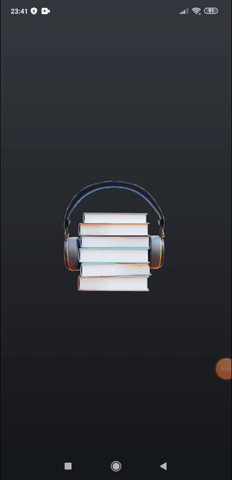

# Engelsiz Kitap

İstanbul Bilgi Üniversitesi Bilgisayar Mühendisliği öğrencilerinden Alihan Ersoy, Halil Çifttur ve Anıl Kılıç'ın 
bitime projesi olarak görme engelliler için yapmış olduğu sesli kitap uygulamasıdır.

[Youtube](# https://youtu.be/hPHRguA-lwI)

[Blogger](# https://codingwithcmpestudent.blogspot.com/2020/05/engelsizkitap.html)

